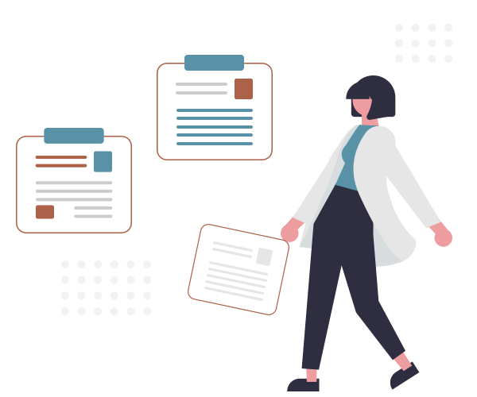

<!-- 
####### Hero section 
-->
<section 
class="hero h-[46rem] justify-end bg-right lg:bg-left border-b-6 border-accent" 
style="background-image: url(../assets/hero.jpg);"
>
  <article class="hero-content text-neutral-content -translate-x-0 md:-translate-x-50">
    

      
For managers of small to mid-sized organizations...

      <h1 class="mb-3 text-5xl leading-14 font-bold">Learn systems for leading with confidence and clarity</h1>
      

        Personalized Management Mastery combines deep insights with practical tools under expert HR guidance to create a personalized leadership roadmap.
      

      <footer class="flex justify-center">
        <button class="btn btn-accent btn-xl btn-wide">
          <svg xmlns="http://www.w3.org/2000/svg" fill="none" viewBox="0 0 24 24" stroke-width="1.5" stroke="currentColor" class="size-7">
            <path stroke-linecap="round" stroke-linejoin="round" d="M4.26 10.147a60.438 60.438 0 0 0-.491 6.347A48.62 48.62 0 0 1 12 20.904a48.62 48.62 0 0 1 8.232-4.41 60.46 60.46 0 0 0-.491-6.347m-15.482 0a50.636 50.636 0 0 0-2.658-.813A59.906 59.906 0 0 1 12 3.493a59.903 59.903 0 0 1 10.399 5.84c-.896.248-1.783.52-2.658.814m-15.482 0A50.717 50.717 0 0 1 12 13.489a50.702 50.702 0 0 1 7.74-3.342M6.75 15a.75.75 0 1 0 0-1.5.75.75 0 0 0 0 1.5Zm0 0v-3.675A55.378 55.378 0 0 1 12 8.443m-7.007 11.55A5.981 5.981 0 0 0 6.75 15.75v-1.5" />
          </svg>
          Register Now
        </button>
      </footer>
    

  </article>
</section>
<!-- 
####### Courses section 
-->
<section class="container-full p-6 sm:py-12 sm:px-22 mx-auto">
  

    <article class="card pt-6 pb-4 bg-base-100 rounded-2xl shadow-lg ring-1 ring-gray-900/5 max-w-100 mx-auto">
      <figure class="px-3">
        
      </figure>
      

        Complete Course
        

          <h2 class="card-title text-lg md:text-xl xl:text-2xl text-primary/75">Management Mastery</h2>
          Level 1
        

        <ul class="flex flex-col gap-2 text-lg ml-2 mt-2 text-primary/55">
          <li class="mb-3">
            <svg xmlns="http://www.w3.org/2000/svg" class="size-6 me-2 inline-block text-secondary/55" fill="none" viewBox="0 0 24 24" stroke="currentColor"><path stroke-linecap="round" stroke-linejoin="round" stroke-width="4" d="M5 13l4 4L19 7" /></svg>
            Insight-driven action plans
          </li>
          <li class="mb-3">
            <svg xmlns="http://www.w3.org/2000/svg" class="size-6 me-2 inline-block text-secondary/55" fill="none" viewBox="0 0 24 24" stroke="currentColor"><path stroke-linecap="round" stroke-linejoin="round" stroke-width="4" d="M5 13l4 4L19 7" /></svg>
            Practicable, actionable strategies
          </li>
          <li class="mb-3">
            <svg xmlns="http://www.w3.org/2000/svg" class="size-6 me-2 inline-block text-secondary/55" fill="none" viewBox="0 0 24 24" stroke="currentColor"><path stroke-linecap="round" stroke-linejoin="round" stroke-width="4" d="M5 13l4 4L19 7" /></svg>
            People manager tools and templates
          </li>
        </ul>
        

          <button class="btn btn-secondary btn-lg btn-wide">
            <svg xmlns="http://www.w3.org/2000/svg" fill="none" viewBox="0 0 24 24" stroke-width="1.5" stroke="currentColor" class="size-6">
              <path stroke-linecap="round" stroke-linejoin="round" d="m21 21-5.197-5.197m0 0A7.5 7.5 0 1 0 5.196 5.196a7.5 7.5 0 0 0 10.607 10.607Z" />
            </svg>
            Level 1
          </button>
        

      

    </article>
    <article class="card pt-6 pb-4 bg-base-100 rounded-2xl shadow-lg ring-1 ring-gray-900/5 max-w-100 mx-auto">
      <figure class="px-3">
        
      </figure>
      

        Complete Course
        

          <h2 class="card-title text-lg md:text-xl xl:text-2xl text-primary/75">Leadership Launch</h2>
          Level 2
        

        <ul class="flex flex-col gap-2 text-lg ml-2 mt-2 text-primary/55">
          <li class="mb-3">
            <svg xmlns="http://www.w3.org/2000/svg" class="size-6 me-2 inline-block text-secondary/55" fill="none" viewBox="0 0 24 24" stroke="currentColor"><path stroke-linecap="round" stroke-linejoin="round" stroke-width="4" d="M5 13l4 4L19 7" /></svg>
            Insight-driven action plans
          </li>
          <li class="mb-3">
            <svg xmlns="http://www.w3.org/2000/svg" class="size-6 me-2 inline-block text-secondary/55" fill="none" viewBox="0 0 24 24" stroke="currentColor"><path stroke-linecap="round" stroke-linejoin="round" stroke-width="4" d="M5 13l4 4L19 7" /></svg>
            Practicable, actionable strategies
          </li>
          <li class="mb-3">
            <svg xmlns="http://www.w3.org/2000/svg" class="size-6 me-2 inline-block text-secondary/55" fill="none" viewBox="0 0 24 24" stroke="currentColor"><path stroke-linecap="round" stroke-linejoin="round" stroke-width="4" d="M5 13l4 4L19 7" /></svg>
            People manager tools and templates
          </li>
        </ul>
        

          <button class="btn btn-secondary btn-lg btn-wide">
            <svg xmlns="http://www.w3.org/2000/svg" fill="none" viewBox="0 0 24 24" stroke-width="1.5" stroke="currentColor" class="size-6">
              <path stroke-linecap="round" stroke-linejoin="round" d="m21 21-5.197-5.197m0 0A7.5 7.5 0 1 0 5.196 5.196a7.5 7.5 0 0 0 10.607 10.607Z" />
            </svg>
            Level 2
          </button>
        

      

    </article>
    <article class="card pt-6 pb-4 bg-base-100 rounded-2xl shadow-lg ring-1 ring-gray-900/5 max-w-100 mx-auto">
      <figure class="px-3">
        
      </figure>
      

        Complete Course
        

          <h2 class="card-title text-lg md:text-xl xl:text-2xl text-primary/75">Performance Powerup</h2>
          Level 3
        

        <ul class="flex flex-col gap-2 text-lg ml-2 mt-2 text-primary/55">
          <li class="mb-3">
            <svg xmlns="http://www.w3.org/2000/svg" class="size-6 me-2 inline-block text-secondary/55" fill="none" viewBox="0 0 24 24" stroke="currentColor"><path stroke-linecap="round" stroke-linejoin="round" stroke-width="4" d="M5 13l4 4L19 7" /></svg>
            Insight-driven action plans
          </li>
          <li class="mb-3">
            <svg xmlns="http://www.w3.org/2000/svg" class="size-6 me-2 inline-block text-secondary/55" fill="none" viewBox="0 0 24 24" stroke="currentColor"><path stroke-linecap="round" stroke-linejoin="round" stroke-width="4" d="M5 13l4 4L19 7" /></svg>
            Practicable, actionable strategies
          </li>
          <li class="mb-3">
            <svg xmlns="http://www.w3.org/2000/svg" class="size-6 me-2 inline-block text-secondary/55" fill="none" viewBox="0 0 24 24" stroke="currentColor"><path stroke-linecap="round" stroke-linejoin="round" stroke-width="4" d="M5 13l4 4L19 7" /></svg>
            People manager tools and templates
          </li>
        </ul>
        

          <button class="btn btn-secondary btn-lg btn-wide">
            <svg xmlns="http://www.w3.org/2000/svg" fill="none" viewBox="0 0 24 24" stroke-width="1.5" stroke="currentColor" class="size-6">
              <path stroke-linecap="round" stroke-linejoin="round" d="m21 21-5.197-5.197m0 0A7.5 7.5 0 1 0 5.196 5.196a7.5 7.5 0 0 0 10.607 10.607Z" />
            </svg>
            Level 3
          </button>
        

      

    </article>
  

</section>
<!-- 
####### Pieces section 
-->
<section class="container-full bg-primary text-primary-content/95 py-12 p-6 sm:py-12 sm:px-22 mx-auto">
  

    <figure class="hidden lg:block">
      
    </figure>
    

      
Stop piecing it together....

      
Start leading with confidence

      

        You’re leading a small team and juggling countless responsibilities and you know that leadership development is crucial for success…but who has the time to cobble together a comprehensive program from scattered resources?
      

      

        You don’t have capacity to add to your endless to-do list. With personalized insights and practical strategies, our leadership solutions are available when you need them—designed to help you grow without the overwhelm.
      

      

        <button class="btn btn-outline btn-primary-content btn-lg btn-wide my-6">
          Learn More
          <svg xmlns="http://www.w3.org/2000/svg" fill="none" viewBox="0 0 24 24" stroke-width="1.5" stroke="currentColor" class="size-6">
            <path stroke-linecap="round" stroke-linejoin="round" d="M13.5 4.5 21 12m0 0-7.5 7.5M21 12H3" />
          </svg>
        </button>
      
 
    

  

</section>
<!-- 
####### Testimonials section 
-->
<section class="container-full p-6 sm:py-12 sm:px-22 mx-auto">
  

    

      <figure class="hover:scale-106 hover:z-1 transform-gpu duration-300 hover:shadow-2xl rounded-2xl bg-base-100 shadow-lg ring-1 ring-gray-900/5 relative sm:col-span-2 xl:col-start-2 xl:row-end-1">
        <blockquote class="p-6 text-lg font-semibold tracking-tight text-primary/90 sm:p-12 sm:text-xl/8 after:absolute after:content-['”'] after:text-[120px] after:font-['serif'] after:right-7 after:-bottom-1 after:font-bold after:text-secondary/35 hover:after:text-secondary/85">
          
“Leslie is excellent at recognizing strengths, developing talent, creating efficiencies, and recommending effective resources. She instills confidence in others and gives them skills to succeed. Her energy and vision are incomparable.

        </blockquote>
        <figcaption class="flex flex-wrap items-center gap-x-4 gap-y-4 border-t border-gray-900/10 px-6 py-4 sm:flex-nowrap">
          
          

            
Taryn

            
Engagement Manager

          

        </figcaption>
      </figure>
      

        

          <figure class="hover:scale-108 hover:z-1 transform-gpu duration-300 hover:shadow-2xl rounded-2xl bg-base-100 p-6 shadow-lg ring-1 ring-gray-900/5 after:absolute after:content-['”'] after:text-[120px] after:font-['serif'] after:right-5 after:font-bold text-secondary/35 hover:text-secondary/85">
            <blockquote class="text-primary">
              
“Leslie's programing helped us so much. I highly recommend working with her!”

            </blockquote>
            <figcaption class="mt-6 flex items-center gap-x-4">
              
              

                
Taryn

                
Engagement Manager

              

            </figcaption>
          </figure>
          <figure class="hover:scale-108 hover:z-1 transform-gpu duration-300 hover:shadow-2xl rounded-2xl bg-base-100 p-6 shadow-lg ring-1 ring-gray-900/5 after:absolute after:content-['”'] after:text-[120px] after:font-['serif'] after:right-5 after:font-bold text-secondary/35 hover:text-secondary/85">
            <blockquote class="text-primary">
              
“I have been able to walk away from meetings with Leslie feeling confident and ready to handle any employee matter.”

            </blockquote>
            <figcaption class="mt-6 flex items-center gap-x-4">
              
              

                
Dawn

                
Research Analyst

              

            </figcaption>
          </figure>
        

        

          <figure class="hover:scale-108 hover:z-1 transform-gpu duration-300 hover:shadow-2xl rounded-2xl bg-base-100 p-6 shadow-lg ring-1 ring-gray-900/5 after:absolute after:content-['”'] after:text-[120px] after:font-['serif'] after:right-5 after:font-bold text-secondary/35 hover:text-secondary/85">
            <blockquote class="text-primary/90">
              
“I strongly encourage anyone in need of human resources support to turn to Leslie.”

            </blockquote>
            <figcaption class="mt-6 flex items-center gap-x-4">
              
              

                
Dawn

                
Research Analyst

              

            </figcaption>
          </figure>
        

      

      

        

          <figure class="hover:scale-108 hover:z-1 transform-gpu duration-300 hover:shadow-2xl rounded-2xl bg-base-100 p-6 shadow-lg ring-1 ring-gray-900/5 after:absolute after:content-['”'] after:text-[120px] after:font-['serif'] after:right-5 after:font-bold text-secondary/35 hover:text-secondary/85">
            <blockquote class="text-primary/90">
              
“Her blend of patience, empathy, and expertise makes her an indispensable ally.”

            </blockquote>
            <figcaption class="mt-6 flex items-center gap-x-4">
              
              

                
Dawn

                
Research Analyst

              

            </figcaption>
          </figure>
        

        

          <figure class="hover:scale-108 hover:z-1 transform-gpu duration-300 hover:shadow-2xl rounded-2xl bg-base-100 p-6 shadow-lg ring-1 ring-gray-900/5 after:absolute after:content-['”'] after:text-[120px] after:font-['serif'] after:right-5 after:font-bold text-secondary/35 hover:text-secondary/85">
            <blockquote class="text-primary">
              
“Empathic, focused, dedicated, and a wealth of experience. What more could you want?”

            </blockquote>
            <figcaption class="mt-6 flex items-center gap-x-4">
              
              

                
Eric York

                
Professor

              

            </figcaption>
          </figure>
          <figure class="hover:scale-108 hover:z-1 transform-gpu duration-300 hover:shadow-2xl rounded-2xl bg-base-100 p-6 shadow-lg ring-1 ring-gray-900/5 after:absolute after:content-['”'] after:text-[120px] after:font-['serif'] after:right-5 after:font-bold text-secondary/35 hover:text-secondary/85">
            <blockquote class="text-primary">
              
“These courses meet the highest educational standards with exceptional, innovative materials.”

            </blockquote>
            <figcaption class="mt-6 flex items-center gap-x-4">
              
              

                
Eric York

                
Professor

              

            </figcaption>
          </figure>
        

      

    

  

</section>
<!-- 
####### Resources section 
-->
<section class="container-full p-6 sm:py-12 sm:px-22 mx-auto bg-base-300">
  <h2 class="text-4xl mb-1">Explore Free Resources</h2>
  <h3 class="text-2xl text-neutral/55 italic">Kickstart your leadership journey with just the right tools . . .</h3>
  

    <article class="card pb-4 bg-base-100 rounded-2xl shadow-lg ring-1 ring-gray-900/5 max-w-100 mx-auto">
      <figure>
        
      </figure>
      

        

          Aug. 6, 2025
          Resource
        

        <h2 class="card-title text-lg md:text-xl xl:text-2xl text-secondary">Everyday Coaching Questions</h2>
        

          Carefully crafted questions to foster deeper, more effective team communication. An easy-to-use tool for leading with intention.
        

        

          <button class="btn btn-secondary btn-lg btn-wide">Coaching Guide 
            <svg xmlns="http://www.w3.org/2000/svg" fill="none" viewBox="0 0 24 24" stroke-width="1.5" stroke="currentColor" class="size-6">
              <path stroke-linecap="round" stroke-linejoin="round" d="M3 16.5v2.25A2.25 2.25 0 0 0 5.25 21h13.5A2.25 2.25 0 0 0 21 18.75V16.5M16.5 12 12 16.5m0 0L7.5 12m4.5 4.5V3" />
            </svg>
          </button>
        

      

    </article>
    <article class="card pb-4 bg-base-100 rounded-2xl shadow-lg ring-1 ring-gray-900/5 max-w-100 mx-auto">
      <figure>
        
      </figure>
      

        

          Aug. 6, 2025
          Resource
        

        <h2 class="card-title text-lg md:text-xl xl:text-2xl text-secondary">One-on-One Meeting Guide</h2>
        

           A structured approach to one-on-one meetings will enhance communication and boost effectiveness. Make the most of your time with this straightforward guide.
        

        

          <button class="btn btn-secondary btn-lg btn-wide">Meetings Guide
            <svg xmlns="http://www.w3.org/2000/svg" fill="none" viewBox="0 0 24 24" stroke-width="1.5" stroke="currentColor" class="size-6">
              <path stroke-linecap="round" stroke-linejoin="round" d="M3 16.5v2.25A2.25 2.25 0 0 0 5.25 21h13.5A2.25 2.25 0 0 0 21 18.75V16.5M16.5 12 12 16.5m0 0L7.5 12m4.5 4.5V3" />
            </svg>
          </button>
        

      

    </article>
    <article class="card pb-4 bg-base-100 rounded-2xl shadow-lg ring-1 ring-gray-900/5 max-w-100 mx-auto">
      <figure>
        
      </figure>
      

        

          Aug. 6, 2025
          Resource
        

        <h2 class="card-title text-lg md:text-xl xl:text-2xl text-secondary">Long-term Leadership Programs</h2>
        

          Running long-lasting leadership programs requires stragtegic vision and lots of experience. Grain both with this introductory guide.
        

        

          <button class="btn btn-secondary btn-lg btn-wide">Program Guide
            <svg xmlns="http://www.w3.org/2000/svg" fill="none" viewBox="0 0 24 24" stroke-width="1.5" stroke="currentColor" class="size-6">
              <path stroke-linecap="round" stroke-linejoin="round" d="M3 16.5v2.25A2.25 2.25 0 0 0 5.25 21h13.5A2.25 2.25 0 0 0 21 18.75V16.5M16.5 12 12 16.5m0 0L7.5 12m4.5 4.5V3" />
            </svg>
          </button>
        

      

    </article>
  

</section>